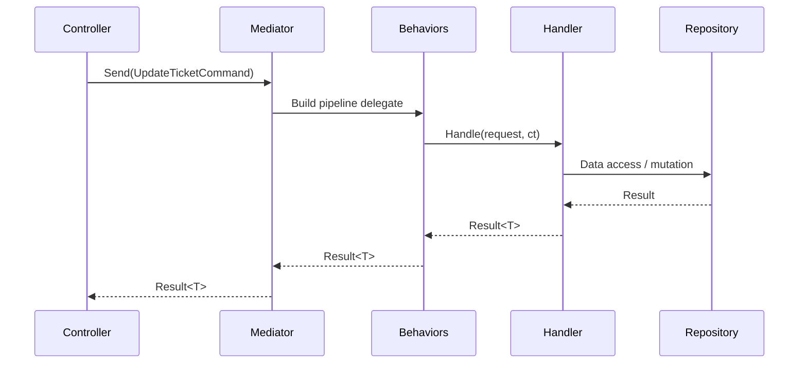

# Custom Mediator Pattern in MiniTicketing

## Overview

This solution uses a lightweight *Mediator* pattern to keep controllers thin and business logic well-encapsulated. Instead of calling repositories or services directly, controllers send strongly typed requests to a mediator (`MiniTicketing.Application.Core.Mediator`), which finds the matching handler, runs any registered pipeline behaviors, and returns the response.

---

## Key Building Blocks

### Requests & Handlers
- Requests implement `IRequest<TResponse>` from `MiniTicketing.Application.Abstractions.IRequest`.
- Handlers implement `IRequestHandler<TRequest, TResponse>` and encapsulate the business logic.
- Example requests/handlers live under `MiniTicketing.Application.Features.*`.

### Mediator (`src/MiniTicketing.Application/Core/Mediator.cs`)
- Uses DI to resolve the appropriate handler for a request.
- Wraps the handler call with any pipeline behaviors (validation, logging, transactions, …).
- Invokes `Handle` via reflection and returns the `Task<TResponse>`.

### Pipeline Behaviors (`src/MiniTicketing.Application/Behaviors`)
- Implement `IPipelineBehavior<TRequest, TResponse>`.
- Provide cross-cutting concerns (validation, logging, transactions).
- Registered in order so they wrap the handler call.

### DI Registration
- `MiniTicketing.Application.ApplicationServicesRegistration` registers pipelines, builders, and **every request handler explicitly**.
- `MiniTicketing.Infrastructure.InfrastructureServicesRegistration` wires infrastructure services (repositories, read services, orchestrators).
- No assembly scanning (Scrutor) is used, keeping registration explicit and predictable.

### Usage from Controllers
- Controllers inject `IMediator`.
- They construct a request (command/query) and call `_mediator.Send(...)`.
- Example: see `TicketsController` actions in `src/MiniTicketing.Api/Controllers/TicketsController.cs`.

---

## Request Lifecycle (Mermaid Diagram)

